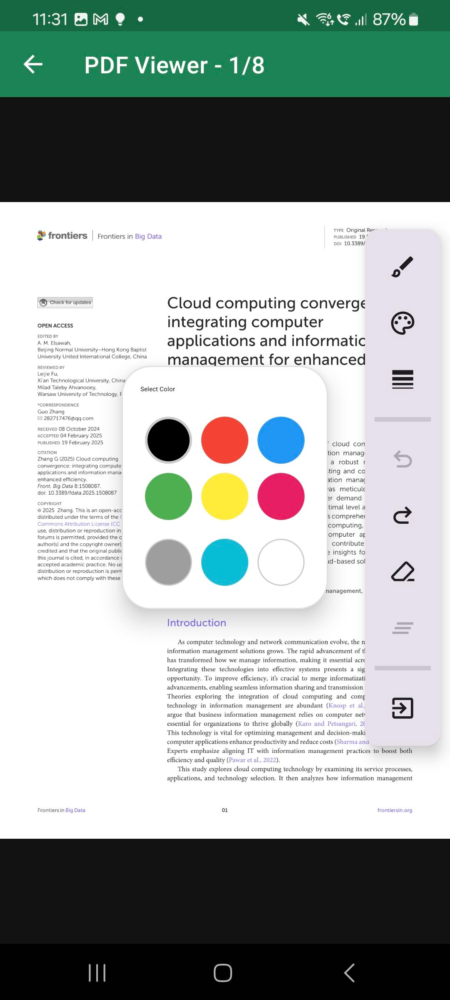
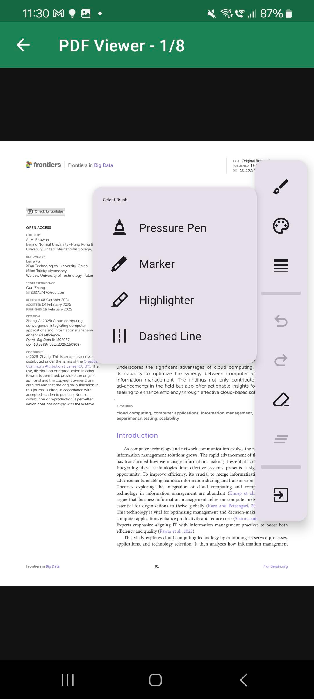
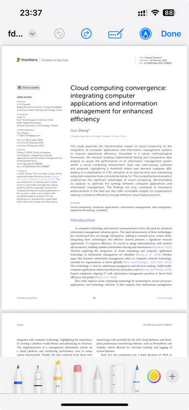

# Capacitor PDF Annotator

[](https://www.npmjs.com/package/capacitor-pdf-annotator)
[](https://www.npmjs.com/package/capacitor-pdf-annotator)
[](https://github.com/AsimNet/capacitor-pdf-annotator/blob/main/LICENSE)
[](https://capacitorjs.com/)
[](https://ko-fi.com/asimnet)

A powerful Capacitor plugin for viewing and annotating PDF documents with stylus/pen support on iOS and Android. Features pressure-sensitive drawing, multiple brush types, dark mode support, and automatic annotation persistence.

## Screenshots

### Android
<p align="center">
  
  
</p>

### iOS
<p align="center">
  
</p>

## Features

- **PDF Viewing**: Native PDF rendering with smooth scrolling and zooming
- **Ink Annotations**: Draw with stylus or finger with pressure sensitivity
- **Multiple Brush Types**: Pressure Pen, Marker, Highlighter, and Dashed Line
- **Color Palette**: 9 customizable colors with easy picker UI
- **Adjustable Stroke Width**: 4 size options (Small, Medium, Large, Extra Large)
- **Eraser Tool**: Stroke-based erasing with undo support
- **Dark Mode Support**: Automatic dark mode for toolbar, dialogs, and floating toolbox
- **Zoom & Pan**: Simultaneous two-finger zoom and pan gestures
- **Auto-Save**: Annotations are automatically saved when closing the viewer
- **Undo/Redo**: Full history support for all drawing operations
- **Theming**: Customize primary color, toolbar color, and status bar color
- **Bilingual**: Supports English and Arabic (RTL)
- **Stylus Detection**: Automatic eraser tip detection for S Pen and Apple Pencil

## Platforms

| Platform | Implementation | Notes |
|----------|---------------|-------|
| iOS | QLPreviewController + PencilKit | Full Apple Pencil support |
| Android | Native PdfRenderer + AndroidX Ink API | S Pen eraser tip support |
| Web | Fallback (opens in new tab) | No annotation support |

## Requirements

- **iOS**: 14.0+
- **Android**: API 30+ (Android 11+)
- **Capacitor**: 7.0+

## Installation

```bash
npm install capacitor-pdf-annotator
npx cap sync
```

### Android Setup

The plugin requires Android API 30+. Update your `android/variables.gradle`:

```groovy
ext {
    minSdkVersion = 30
    compileSdkVersion = 35
    targetSdkVersion = 35
}
```

### iOS Setup

No additional configuration required. The plugin uses QLPreviewController with PencilKit which is available on iOS 14+.

If loading files from external locations, add to your `Info.plist`:

```xml
<key>UISupportsDocumentBrowser</key>
<true/>
<key>LSSupportsOpeningDocumentsInPlace</key>
<true/>
```

## Usage

### Basic Usage

```typescript
import { PdfAnnotator } from 'capacitor-pdf-annotator';

// Open a PDF file for viewing and annotation
const result = await PdfAnnotator.openPdf({
  url: 'file:///path/to/document.pdf'
});

if (result.saved) {
  console.log('Annotations saved to:', result.savedPath);
}
```

### With Theming

```typescript
import { PdfAnnotator } from 'capacitor-pdf-annotator';

await PdfAnnotator.openPdf({
  url: 'file:///path/to/document.pdf',
  title: 'My Document',
  enableAnnotations: true,
  enableInk: true,
  inkColor: '#2196F3',      // Default ink color (blue)
  inkWidth: 3.0,            // Default stroke width
  primaryColor: '#1C8354',  // FAB and accent color
  toolbarColor: '#1C8354',  // Toolbar background
  statusBarColor: '#166A45' // Status bar (Android)
});
```

### With Custom Color Palette

```typescript
import { PdfAnnotator } from 'capacitor-pdf-annotator';

await PdfAnnotator.openPdf({
  url: 'file:///path/to/document.pdf',
  enableInk: true,
  // Custom 9-color palette (Android only)
  colorPalette: [
    '#000000', // Black
    '#F44336', // Red
    '#2196F3', // Blue
    '#4CAF50', // Green
    '#FFEB3B', // Yellow
    '#E91E63', // Pink
    '#9E9E9E', // Gray
    '#00BCD4', // Cyan
    '#FFFFFF'  // White
  ]
});
```

### Check Device Support

```typescript
import { PdfAnnotator } from 'capacitor-pdf-annotator';

const support = await PdfAnnotator.isInkSupported();

console.log('Ink supported:', support.supported);
console.log('Stylus connected:', support.stylusConnected);
console.log('Low-latency ink:', support.lowLatencyInk); // Android only
```

### Listen for Events

```typescript
import { PdfAnnotator } from 'capacitor-pdf-annotator';

// Listen for save events
const saveListener = await PdfAnnotator.addListener('pdfSaved', (event) => {
  console.log('PDF saved:', event.path);
  console.log('Save type:', event.type); // 'updated' or 'copy'
});

// Listen for annotation events
const annotationListener = await PdfAnnotator.addListener('annotationAdded', (event) => {
  console.log('Annotation type:', event.type); // 'ink', 'text', or 'highlight'
  console.log('Page:', event.page);
});

// Remove specific listener
await saveListener.remove();

// Or remove all listeners
await PdfAnnotator.removeAllListeners();
```

## Framework Examples

### Angular / Ionic

```typescript
import { Component } from '@angular/core';
import { PdfAnnotator } from 'capacitor-pdf-annotator';
import { Filesystem, Directory } from '@capacitor/filesystem';

@Component({
  selector: 'app-pdf-viewer',
  template: `<ion-button (click)="openPdf()">Open PDF</ion-button>`
})
export class PdfViewerComponent {
  async openPdf() {
    // Get file from app's data directory
    const file = await Filesystem.getUri({
      path: 'documents/lecture.pdf',
      directory: Directory.Data
    });

    const result = await PdfAnnotator.openPdf({
      url: file.uri,
      title: 'Lecture Notes',
      primaryColor: '#3880ff', // Ionic primary color
      enableInk: true
    });

    if (result.saved) {
      console.log('Document annotated and saved');
    }
  }
}
```

### React / Capacitor

```tsx
import { PdfAnnotator } from 'capacitor-pdf-annotator';
import { Filesystem, Directory } from '@capacitor/filesystem';

function PdfButton() {
  const openPdf = async () => {
    const file = await Filesystem.getUri({
      path: 'documents/report.pdf',
      directory: Directory.Data
    });

    const result = await PdfAnnotator.openPdf({
      url: file.uri,
      title: 'Report',
      primaryColor: '#61dafb',
      enableInk: true
    });

    if (result.saved) {
      alert('Annotations saved!');
    }
  };

  return <button onClick={openPdf}>Open PDF</button>;
}
```

### Vue / Capacitor

```vue
<template>
  <button @click="openPdf">Open PDF</button>
</template>

<script setup lang="ts">
import { PdfAnnotator } from 'capacitor-pdf-annotator';
import { Filesystem, Directory } from '@capacitor/filesystem';

const openPdf = async () => {
  const file = await Filesystem.getUri({
    path: 'documents/notes.pdf',
    directory: Directory.Data
  });

  const result = await PdfAnnotator.openPdf({
    url: file.uri,
    title: 'Notes',
    primaryColor: '#42b883',
    enableInk: true
  });

  if (result.saved) {
    console.log('Saved to:', result.savedPath);
  }
};
</script>
```

## API Reference

### openPdf(options)

Opens a PDF document for viewing and annotation.

#### Options

| Option | Type | Default | Description |
|--------|------|---------|-------------|
| `url` | `string` | **required** | URL or file path to the PDF. Supports `file://` URLs and absolute paths |
| `title` | `string` | `undefined` | Title shown in the toolbar |
| `enableAnnotations` | `boolean` | `true` | Enable annotation tools |
| `enableInk` | `boolean` | `true` | Enable ink/drawing tools |
| `inkColor` | `string` | `'#000000'` | Default ink color (hex format) |
| `inkWidth` | `number` | `2.0` | Default ink stroke width in points |
| `initialPage` | `number` | `0` | Initial page to display (0-indexed) |
| `enableTextSelection` | `boolean` | `true` | Enable text selection |
| `enableSearch` | `boolean` | `true` | Enable search functionality |
| `primaryColor` | `string` | `undefined` | Primary theme color for FAB and accents (hex) |
| `toolbarColor` | `string` | `undefined` | Toolbar background color (hex) |
| `statusBarColor` | `string` | `undefined` | Status bar color - Android only (hex) |
| `colorPalette` | `string[]` | Material colors | Custom color palette (max 9) - Android only |

#### Returns

```typescript
interface OpenPdfResult {
  dismissed: boolean;    // Whether the viewer was dismissed
  saved?: boolean;       // Whether annotations were saved
  savedPath?: string;    // Path to saved PDF (if different from original)
}
```

### isInkSupported()

Checks if ink annotations are supported on the current device.

#### Returns

```typescript
interface InkSupportResult {
  supported: boolean;        // Whether ink input is supported
  stylusConnected?: boolean; // Whether a stylus is connected
  lowLatencyInk?: boolean;   // Whether low-latency ink is available (Android)
}
```

## Events

### pdfSaved

Fired when the PDF is saved with annotations.

```typescript
interface PdfSavedEvent {
  path: string;              // Path to the saved PDF file
  type: 'updated' | 'copy';  // Type of save operation
}
```

### annotationAdded

Fired when an annotation is added to the document.

```typescript
interface AnnotationEvent {
  type: 'ink' | 'text' | 'highlight';  // Type of annotation
  page: number;                         // Page number (0-indexed)
}
```

## Drawing Tools

### Brush Types (Android)

| Brush | Description |
|-------|-------------|
| **Pressure Pen** | Pressure-sensitive pen with variable stroke width |
| **Marker** | Consistent stroke width regardless of pressure |
| **Highlighter** | Semi-transparent strokes for highlighting text |
| **Dashed Line** | Dashed stroke pattern |

### Gestures

| Gesture | Action |
|---------|--------|
| Single finger | Draw (when drawing mode enabled) |
| Two-finger pinch | Zoom in/out |
| Two-finger drag | Pan (works simultaneously with zoom) |
| Double tap | Toggle zoom level |
| S Pen eraser tip | Erase strokes (Samsung devices) |

## Dark Mode

The plugin automatically supports dark mode on both platforms:

- **Toolbar**: Adapts to system dark mode
- **Floating Toolbox**: Dark purple background in dark mode
- **Color Picker Dialog**: Dark background with proper contrast
- **Brush/Size Selectors**: Automatic theme switching

No additional configuration required - the plugin respects the system theme.

## Localization

The plugin supports:
- **English** (default)
- **Arabic** (RTL support)

Language is automatically detected from device settings. All UI strings including toolbar, dialogs, and button labels are localized.

## Troubleshooting

### Android

**Build fails with "Dependency requires at least JVM runtime version 11"**

Set JAVA_HOME to use JDK 11 or higher:
```bash
export JAVA_HOME="/Applications/Android Studio.app/Contents/jbr/Contents/Home"
```

**PDF not loading from external storage**

Ensure you have storage permissions and the file exists:
```typescript
import { Filesystem } from '@capacitor/filesystem';

const stat = await Filesystem.stat({ path: filePath });
console.log('File exists:', stat.size > 0);
```

**Annotations not saving**

The plugin saves annotations to a separate JSON file. Ensure the app has write access to the directory containing the PDF.

### iOS

**PencilKit not appearing**

Ensure the device supports Apple Pencil or enable finger drawing in the annotation toolbar.

**PDF opens but cannot annotate**

Check that `enableAnnotations` and `enableInk` are set to `true` (they are by default).

## Migration from v1.2.x to v1.3.x

Version 1.3.x includes several improvements:

1. **Dark mode support** - No code changes needed, automatic
2. **Improved zoom/pan** - Simultaneous gestures now work properly
3. **Highlighter persistence** - Fixed highlighter appearing dark after reload
4. **Stylus eraser** - S Pen eraser tip now works correctly

No breaking API changes.

## Support

If you find this plugin helpful, consider supporting the development:

[](https://ko-fi.com/asimnet)

## Contributing

Contributions are welcome! Please read our contributing guidelines and submit pull requests to the `dev` branch.

```bash
# Clone the repo
git clone https://github.com/AsimNet/capacitor-pdf-annotator.git

# Install dependencies
npm install

# Build the plugin
npm run build

# Run tests
npm run verify
```

## License

MIT

## Contributors

- [Nasser](https://github.com/newer97) - iOS implementation (QLPreviewController + PencilKit)

## Credits

- [Android PdfRenderer](https://developer.android.com/reference/android/graphics/pdf/PdfRenderer) - Native PDF rendering
- [AndroidX Ink API](https://developer.android.com/develop/ui/views/touch-and-input/stylus-input/about-ink-api) - Low-latency stylus input
- [PencilKit](https://developer.apple.com/documentation/pencilkit) - iOS drawing framework
